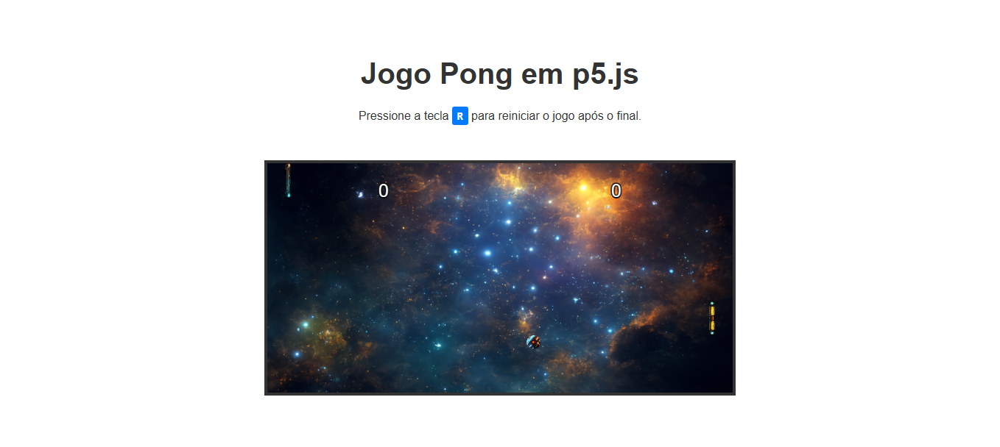

<h1 align="center"> Jogo Pong </h1>

#### ⚙️ Desenvolvimento de um jogo de pong com o `p5js`. Construída durante o <em>Oracle Next Education-T7</em> no curso `GitHub Copilot e ChatGPT: Impulsionando seu desenvolvimento com IA`. ⚙️

 

  

 

## 🛠 Tecnologias

Esse projeto foi desenvolvido com as seguintes tecnologias:

- **[HTML](https://developer.mozilla.org/pt-BR/docs/Web/HTML)**
- **[CSS](https://developer.mozilla.org/pt-BR/docs/Web/CSS/CSS_flexible_box_layout/Basic_concepts_of_flexbox)**
- **[Javascript](https://developer.mozilla.org/pt-BR/docs/Web/JavaScript)**
- **[p5-js](https://cdnjs.cloudflare.com/ajax/libs/p5.js/0.5.16/p5.min.js)**

 

## 📝 License

  

Esse projeto está sob a licença MIT.

 

### 👨‍💻 Autor

 
 <em>Ciro Batista da Silva<em>
 
  

 
👋🏽 Entre em contato!

 

